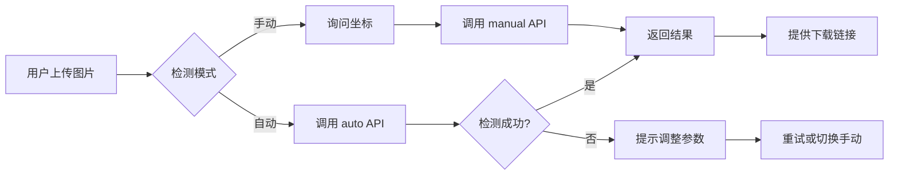

# Dify 集成指南

将微信水印去除功能集成到 Dify Agent 的完整指南。

## 📋 前置准备

### 1. 启动 API 服务

```bash
# 安装额外依赖
pip install fastapi uvicorn python-multipart

# 启动服务
python watermark_removal_api.py
```

服务将运行在 `http://localhost:8000`

### 2. 验证服务运行

```bash
curl http://localhost:8000/
```

应该返回：
```json
{
  "status": "running",
  "service": "Watermark Removal API",
  "version": "1.0.0",
  "device": "cuda"
}
```

## 🔧 Dify 集成方式

### 方式 1: 作为自定义工具（推荐）

在 Dify 中创建自定义工具，配置如下：

#### 工具配置

**基本信息：**
- 工具名称：`watermark_remover`
- 描述：`去除图片中的微信公众号水印`
- 图标：🧹

**API 配置：**

```yaml
# 工具配置 (OpenAPI Schema)
openapi: 3.0.0
info:
  title: Watermark Removal Tool
  version: 1.0.0

servers:
  - url: http://localhost:8000

paths:
  /api/remove-watermark/auto:
    post:
      summary: 自动检测并去除水印
      operationId: removeWatermarkAuto
      requestBody:
        required: true
        content:
          multipart/form-data:
            schema:
              type: object
              properties:
                file:
                  type: string
                  format: binary
                  description: 上传的图片文件
                dilate_kernel_size:
                  type: integer
                  default: 25
                  description: 膨胀核大小(15-35)
                threshold:
                  type: integer
                  default: 200
                  description: 检测阈值(150-220)
                detection_mode:
                  type: string
                  default: brightness
                  enum: [brightness, position]
                  description: 检测模式
              required:
                - file
      responses:
        '200':
          description: 成功
          content:
            application/json:
              schema:
                type: object
                properties:
                  success:
                    type: boolean
                  message:
                    type: string
                  file_id:
                    type: string
                  watermark_region:
                    type: array
                    items:
                      type: integer
                  download_url:
                    type: string

  /api/remove-watermark/manual:
    post:
      summary: 手动指定坐标去除水印
      operationId: removeWatermarkManual
      requestBody:
        required: true
        content:
          multipart/form-data:
            schema:
              type: object
              properties:
                file:
                  type: string
                  format: binary
                x1:
                  type: integer
                y1:
                  type: integer
                x2:
                  type: integer
                y2:
                  type: integer
                dilate_kernel_size:
                  type: integer
                  default: 25
              required:
                - file
                - x1
                - y1
                - x2
                - y2
      responses:
        '200':
          description: 成功
```

### 方式 2: 通过 HTTP 请求节点

在 Dify 工作流中添加 HTTP 请求节点：

#### 节点配置示例

**自动检测模式：**

```yaml
节点类型: HTTP Request
请求方法: POST
URL: http://localhost:8000/api/remove-watermark/auto
请求头:
  Content-Type: multipart/form-data
请求体:
  file: {{image_file}}  # 从上游节点获取
  dilate_kernel_size: 25
  threshold: 200
  detection_mode: brightness
```

**手动指定模式：**

```yaml
节点类型: HTTP Request
请求方法: POST
URL: http://localhost:8000/api/remove-watermark/manual
请求体:
  file: {{image_file}}
  x1: {{watermark_x1}}
  y1: {{watermark_y1}}
  x2: {{watermark_x2}}
  y2: {{watermark_y2}}
  dilate_kernel_size: 25
```

## 🤖 Agent 提示词模板

为你的 Dify Agent 配置以下系统提示词：

```markdown
你是一个专业的图片处理助手，擅长去除微信公众号图片水印。

你有以下能力：
1. 自动检测并去除图片中的水印
2. 根据用户指定的坐标精确去除水印
3. 批量处理多张图片

使用指南：
- 当用户上传图片并要求去除水印时，默认使用自动检测模式
- 如果自动检测效果不理想，询问用户是否知道水印的具体位置
- 如果用户提供了坐标信息，使用手动模式
- 处理完成后，提供下载链接给用户

示例对话：

用户："帮我去除这张图片的水印"
助手：[调用 watermark_remover 工具，自动模式]
      "已成功去除水印！处理后的图片：[下载链接]
       检测到的水印区域：左上角(700, 1180)，右下角(850, 1240)"

用户："这个位置不对，水印在右下角"
助手：[调用 watermark_remover 工具，位置模式：bottom_right]
      "已重新处理，使用右下角区域。新的结果：[下载链接]"
```

## 📝 完整工作流示例

### 场景 1: 智能去水印 Agent



### 场景 2: 批量处理工作流

1. **文件收集节点**: 收集用户上传的多张图片
2. **循环节点**: 遍历所有图片
3. **HTTP 请求节点**: 调用 `/api/remove-watermark/auto`
4. **结果汇总节点**: 收集所有处理结果
5. **输出节点**: 返回所有下载链接

## 🔌 API 端点详解

### 1. 自动检测模式

```bash
POST /api/remove-watermark/auto
```

**最佳使用场景：**
- 用户不知道水印具体位置
- 水印是浅色（白色/灰色）文字
- 快速处理单张图片

**参数说明：**
- `threshold`: 亮度阈值
  - 200: 适合大多数微信水印（默认）
  - 180-190: 适合稍暗的水印
  - 210-220: 适合非常明亮的水印

### 2. 手动指定模式

```bash
POST /api/remove-watermark/manual
```

**最佳使用场景：**
- 自动检测失败
- 水印位置固定
- 需要精确控制

**坐标获取方法：**
- 使用图片编辑工具查看坐标
- 使用之前提供的交互式工具
- 根据经验估算（如：图片右下角 1/4 区域）

### 3. 批量处理模式

```bash
POST /api/remove-watermark/batch
```

**最佳使用场景：**
- 多张图片水印位置相同
- 批量处理公众号文章配图
- 自动化工作流

**位置参数：**
- `bottom_right`: 右下角（最常见）
- `bottom_center`: 底部居中
- `bottom_left`: 左下角
- `top_right`: 右上角
- `center`: 中心位置

## 🎯 实际应用案例

### 案例 1: 公众号编辑助手

```python
# Dify Agent 配置
{
  "name": "公众号图片处理助手",
  "description": "帮助去除公众号图片水印",
  "tools": ["watermark_remover"],
  "prompt": "你是一个专业的公众号编辑助手..."
}
```

**对话示例：**
```
用户: 帮我处理这10张公众号配图，去掉水印
Agent: 
1. [识别上传的10张图片]
2. [调用批量处理 API]
3. 已完成！所有图片已去除水印：
   - 图片1: [下载链接]
   - 图片2: [下载链接]
   ...
```

### 案例 2: 智能客服

```
用户: 我的产品图片有水印，能帮我去掉吗？
Agent: 当然可以！请上传图片。
用户: [上传图片]
Agent: 
[自动检测水印]
✅ 已成功去除水印！
📍 检测到的水印位置：右下角 (1200, 800) - (1400, 900)
📥 下载链接: [点击下载]

如果位置不准确，请告诉我正确的位置，我可以重新处理。
```

## ⚙️ 高级配置

### 调优参数

```python
# 针对不同类型的水印调整参数

# 1. 微信公众号水印（浅色半透明）
{
  "threshold": 200,
  "dilate_kernel_size": 25
}

# 2. 深色水印
{
  "threshold": 150,
  "dilate_kernel_size": 30
}

# 3. 小水印（LOGO）
{
  "threshold": 200,
  "dilate_kernel_size": 15
}

# 4. 大面积水印
{
  "threshold": 200,
  "dilate_kernel_size": 35
}
```

### 错误处理

在 Dify 工作流中添加错误处理：

```yaml
条件分支节点:
  条件: {{http_response.success}} == true
  
  成功分支:
    - 提取 file_id
    - 构建下载链接
    - 返回给用户
  
  失败分支:
    - 检查错误信息
    - 如果是"未检测到水印"
      -> 询问用户是否知道水印位置
      -> 切换到手动模式
    - 其他错误
      -> 显示错误信息
      -> 提示重试
```

## 📊 性能优化建议

### 1. 模型选择

```python
# 根据服务器性能选择模型
SAM_MODEL_TYPE = "vit_b"  # 推荐，速度快
# SAM_MODEL_TYPE = "vit_h"  # 精度高，但慢
```

### 2. 批处理策略

```python
# 对于大量图片，使用队列处理
# 在 Dify 中可以配置：
max_concurrent_requests = 3  # 最大并发数
request_timeout = 60  # 超时时间（秒）
```

### 3. 缓存策略

```python
# 对于相同图片，缓存处理结果
# 在 API 中添加缓存逻辑（可选）
```

## 🔐 安全建议

1. **生产环境部署：**
   ```python
   # 添加 API Key 验证
   # 限制文件大小
   # 添加请求频率限制
   ```

2. **Dify 配置：**
   - 限制上传文件大小（建议 10MB）
   - 设置请求超时时间
   - 启用日志记录

## 📞 常见问题

**Q: Dify 无法连接到 API？**
A: 检查：
- API 服务是否运行
- 端口是否正确
- 防火墙设置
- Dify 和 API 是否在同一网络

**Q: 处理速度慢？**
A: 
- 使用 GPU 加速
- 切换到 vit_b 模型
- 减小图片尺寸
- 启用批处理

**Q: 自动检测失败？**
A: 
- 调整 threshold 参数
- 尝试不同的 detection_mode
- 切换到手动模式

## 🎓 下一步

1. 在 Dify 中创建自定义工具
2. 配置 Agent 系统提示词
3. 测试不同场景
4. 优化参数配置
5. 部署到生产环境

---

如有问题，欢迎提 Issue！